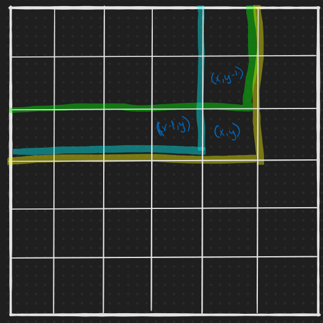

# Day 11: Chronal Charge - [Part 1](11.ts) & [Part 2](11b.ts)
The low fuel warning light is illuminated on your wrist-mounted device. Tapping it once causes it to project a hologram of the situation: a **300x300** grid of fuel cells and their current power levels, some negative. You're not sure what negative power means in the context of time travel, but it can't be good.

Each fuel cell has a coordinate ranging **from 1 to 300** in both the X (horizontal) and Y (vertical) direction. In `X,Y` notation, the top-left cell is `1,1`, and the top-right cell is `300,1`.

The interface lets you select **any 3x3 square** of fuel cells. To increase your chances of getting to your destination, you decide to choose the 3x3 square with the **largest total power**.

The power level in a given fuel cell can be found through the following process:
1. Find the fuel cell's **rack ID**, which is its **X coordinate plus 10**.
2. Begin with a power level of the **rack ID** times the **Y coordinate**.
3. Increase the power level by the value of the **grid serial number** (your puzzle input).
4. Set the power level to itself multiplied by the **rack ID**.
5. Keep only the **hundreds digit** of the power level (so `12345` becomes `3`; numbers with no hundreds digit become `0`).
6. **Subtract 5** from the power level.

For example, to find the power level of the fuel cell at 3,5 in a grid with serial number `8`:

1. The rack ID is `3 + 10 = `**`13`**.
2. The power level starts at `13 * 5 = `**`65`**.
3. Adding the serial number produces `65 + 8 = `**`73`**.
4. Multiplying by the rack ID produces `73 * 13 = `**`949`**.
5. The hundreds digit of `94`**`9`** is **`9`**.
6. Subtracting 5 produces `9 - 5 = `**`4`**.

So, the power level of this fuel cell is **`4`**.

Here are some more example power levels:

* Fuel cell at  `122,79`, grid serial number `57`: power level `-5`.
* Fuel cell at `217,196`, grid serial number `39`: power level  `0`.
* Fuel cell at `101,153`, grid serial number `71`: power level  `4`.

Your goal is to find the 3x3 square which has the largest total power. The square must be entirely within the 300x300 grid. Identify this square using the `X,Y` coordinate of its **top-left fuel cell**. For example:

For grid serial number `18`, the largest total 3x3 square has a top-left corner of **`33,45`** (with a total power of `29`); these fuel cells appear in the middle of this 5x5 region:
```
-2  -4   4   4   4
-4   4   4   4  -5
 4   3   3   4  -4
 1   1   2   4  -3
-1   0   2  -5  -2
```

For grid serial number `42`, the largest 3x3 square's top-left is **`21,61`** (with a total power of `30`); they are in the middle of this region:
```
-3   4   2   2   2
-4   4   3   3   4
-5   3   3   4  -4
 4   3   3   4  -3
 3   3   3  -5  -1
```
**What is the X,Y coordinate of the top-left fuel cell of the 3x3 square with the largest total power?**

Your puzzle answer was 235,85.

### Part 2
You discover a dial on the side of the device; it seems to let you select a square of **any size**, not just 3x3. Sizes from 1x1 to 300x300 are supported.

Realizing this, you now must find the **square of any size with the largest total power**. Identify this square by including its size as a third parameter after the top-left coordinate: a 9x9 square with a top-left corner of `3,5` is identified as `3,5,9`.

For example:

* For grid serial number `18`, the largest total square (with a total power of `113`) is 16x16 and has a top-left corner of 90,269, so its identifier is **`90,269,16`**.
* For grid serial number 42, the largest total square (with a total power of 119) is 12x12 and has a top-left corner of 232,251, so its identifier is **`232,251,12`**.

**What is the X,Y,size identifier of the square with the largest total power?**

## Solution
The only thing common between the two parts is:

```typescript
export interface ISize {
    width: number;
    height: number;
}

export const makeGetPower = (serial: number) => ({row, col}: IPoint) => {
    const rackId = col + 10;
    let power = row * rackId + serial;
    power *= rackId;
    power = Math.trunc(power / 100) % 10;
    return power - 5;
};
```

### Part 1
I brute-forced it. I computed the power levels for all 90,000 squares (300x300), stored it in a `Map`, and used that to find the optimal `3x3` square.

To generate the `Map`:
```typescript
export const getPowerLevels = (grid: ISize, serial: number) => {
    const powerLevels = new Map<string, number>();
    const getPower = makeGetPower(serial);
    for (let i = 1; i <= grid.height; i++)
        for (let j = 1; j <= grid.width; j++) {
            const p = {row: i, col: j};
            powerLevels.set(toKey(p), getPower(p));
        }
    return powerLevels;
};
```

To get the total power within a small `square` (of 3x3) given the the `powerLevels Map` from above, and the `starting` position:
```typescript
const makeGetTotalPower =
    (square: ISize, powerLevels: Map<string, number>) =>
    (starting: IPoint) =>
{
    let totalPower = 0;
    for (let i = 0; i < square.height; i++)
        for (let j = 0; j < square.width; j++)
            totalPower += powerLevels.get(toKey(add(starting)({row: i, col: j})))!;
    return totalPower;
};
```

And finally, to find the maximum total power in the `300x300`:

```typescript
export const makeGetLargestPower = (grid: ISize, serial: number) => {
    const powerLevels = getPowerLevels(grid, serial);

    return (square: ISize) => {
        let maxPower = -1;
        let maxPowerPoint = {row: 0, col: 0};
        const getTotalPower = makeGetTotalPower(square, powerLevels);
        for (let i = 1; i <= grid.height - square.height; i++) {
            for (let j = 1; j <= grid.width - square.width; j++) {
                const p = {row: i, col: j};
                const curr = getTotalPower(p);
                if (curr > maxPower) {
                    maxPower = curr;
                    maxPowerPoint = p;
                }
            }
        }
        return {
            coordinate: `${maxPowerPoint.col},${maxPowerPoint.row}`,
            power: maxPower
        };
    };
};
```

This solution has a run-time of , where  and , which is okay since  is so small (**runs in 150ms**), but as we'll see in part 2, this blows up to  and is no longer sustainable.

### Part 2
#### Attempt 1: Brute-force - 
This solution just builds off of part 1:
```typescript
export const getLargestPowerAndSize = (serial: number) => {
    const getLargestPower = makeGetLargestPower({height: 300, width: 300}, serial);
    let maxPower = {coordinate: 'null', power: -1};
    let maxSize = 1;

    for (let size = 1; size <= 300; size++) {
        console.log(`at size = ${size}`);
        const currPower = getLargestPower({height: size, width: size});
        if (currPower.power > maxPower.power) {
            maxPower = currPower;
            maxSize = size;
        }
    }

    return `${maxPower.coordinate},${maxSize}`;
};
```

How is it ? We know that `makeGetLargestPower` is providing the  like it did in part 1, but the `makeGetTotalPower` from part 1 and `getLargestPowerAndSize` from part 2 have a runtime of:

```
size = 1        makeGetTotalPower = 1^2
size = 2        makeGetTotalPower = 2^2
size = 3        makeGetTotalPower = 3^2
...
size = 300      makeGetTotalPower = 300^2
```

Which brings us to

<p align="center"></p>

Thus, . This solution takes a **couple hours** to run.

#### Attempt 2: Divide-and-conquer - 
Quick run-down of what it does:
1. Get the power levels at each `X,Y` cell (my program calls it `col,row`) and store it in a cache under the key of `col,row,size`. So for this step, all power levels retrieved will be store with a key of `col,row,1`.
    * `size` goes to the right and down, so the key `5,4,10` will store the total power level in the sub-grid `[(5,4), (15,4), (15,14), (5, 14)]`.
    * This takes $O(n^2)$.
2. Do a **divide-and-conquer**.
    * If `size` is an *even* number, recursively get the total power for the **four** smaller squares of size `size / 2` that make up up the square of size `size`, storing and retrieving from `cache` when it can.
    * If `size` is an *odd* number, recursively get the total power for the area `size - 1`, and add up all the perimeters on the bottom row and the right column.
    * This part takes $O(n)$. See [appendix](#appendix) below for more details.

    Here is a diagram of how it breaks down a `6x6` and a `7x7`:

    
3. Finally, for every valid `row,col,size` pair, call `divideConquer` from above. This is .

Since step 2 is  and step 3 is , we get . 

The final code:

```typescript
export const getLargestPowerAndSize = (serial: number) => {
    const maxSide = 300;
    // col,row,size -> powerLevel
    // initially, it stores col,row,1 (i.e., power levels at individual cells),
    // which is 90,000 entries.
    const cache = new Map(
        Array.from(getPowerLevels({height: maxSide, width: maxSide}, serial).entries())
            .map(([p, v]) => [`${p},1`, v])
    );
    const divideConquer = (size: number, from: IPoint): number => {
        const cacheKey = `${toKey(from)},${size}`;
        if (cache.has(cacheKey))
            return cache.get(cacheKey)!;

        if (size % 2 === 0) {
            const quarterSize = size / 2;
            const powerLevel =
                divideConquer(quarterSize, from) +
                divideConquer(quarterSize, add(from)({row: quarterSize, col: 0})) +
                divideConquer(quarterSize, add(from)({row: 0, col: quarterSize})) +
                divideConquer(quarterSize, add(from)({row: quarterSize, col: quarterSize}));
            cache.set(cacheKey, powerLevel);
            return powerLevel;
        }
        const smallerSize = size - 1;
        let powerLevel = divideConquer(smallerSize, from);
        // add bottom row
        for (let i = 0; i < size; i++)
            powerLevel += cache.get(`${toKey(add(from)({row: smallerSize, col: i}))},1`)!;

        // add right column
        for (let i = 0; i < smallerSize; i++)
            powerLevel += cache.get(`${toKey(add(from)({row: i, col: smallerSize}))},1`)!;

        cache.set(cacheKey, powerLevel);
        return powerLevel;
    };

    let maxPower = 0;
    let maxPowerStart = {row: 0, col: 0};
    let maxPowerSize = 300;
    for (let s = 2; s <= 300; s++) {
        let maxPowerForSize = 0;
        for (let i = 1; i <= maxSide - s + 1; i++) {
            for (let j = 1; j <= maxSide - s + 1; j++) {
                const powerLevel = divideConquer(s, {row: i, col: j});
                if (powerLevel > maxPower) {
                    maxPower = powerLevel;
                    maxPowerStart = {row: i, col: j};
                    maxPowerSize = s;
                }
                if (powerLevel > maxPowerForSize)
                    maxPowerForSize = powerLevel;
            }
        }
        // short circuit it sooner!
        if (maxPowerForSize === 0)
            break;
         console.log('cacheSize', cache.size, 'size', s, 'maxPowerForSize', maxPowerForSize);
    }
    console.log('maxPower', maxPower, 'maxPowerStart', maxPowerStart, 'maxPowerSize', maxPowerSize);
    return maxPower;
};
```

The short-circuit is important. After some experimentation, I realized that the maximum total power increased from `size = 1` to `size = S`, where `S` is max size, with some ups-and-down. After `size = S` though, the size generally starts to decrease and eventually goes below `0`. Thus, there's no point computing the total power for those sizes, and it therefore just stops.

With the short-circuit, it takes about **11 seconds** to find the maximum. Without the short-circuit, the program fully runs for **5 minutes**.

**Note:** I played around with a better divide-and-conquer and came up with a better way of dividing odd sizes. See [appendix](#appendix) below for more details.

#### Attempt 3: Summed Area Table -  - 70ms
[Summed-area table](https://en.wikipedia.org/wiki/Summed-area_table) is an efficient algorithm for getting the sum of values in a rectangular subset of a grid.

As the name suggests, the value at any point (x, y) in the summed-area table is the **sum of all the pixels above and to the left** of (x, y), inclusive. If  is the value of pixel at , then the summed-area table  can be computed in a single pass over the image, as the value  in the summed-area table  is just

<p align="center"></p>

Why the subtraction at the end? Because of **double counting**. Here's a diagram of it:



We're trying to get the sum of all cells to the top and left of `(x,y)`, so we add the already-computed values of  and . Notice how we've double counted the region that starts at  (not shown). We just have to subtract that area off once, and we'll be done!

The code for this is pretty straightforward and just :

```typescript
export const makeGetPower = (serial: number) => ({row, col}: IPoint) => {
    const rackId = col + 10;
    let power = row * rackId + serial;
    power *= rackId;
    power = Math.trunc(power / 100) % 10;
    return power - 5;
};

export const getPowerLevelsGrid = (grid: ISize, serial: number) => {
    const powerLevels = Array.from({length: grid.height + 1}, () => [0]);
    powerLevels[0] = Array.from({length: grid.width + 1}, () => 0);
    const getPower = makeGetPower(serial);
    for (let i = 1; i <= grid.height; i++)
        for (let j = 1; j <= grid.width; j++)
            powerLevels[i][j] = getPower({row: i, col: j});
    return powerLevels;
};

export const toSummedAreaTable = (powerGrid: number[][]) => {
    for (let i = 1; i < powerGrid.length; i++)
        for (let j = 1; j < powerGrid[i].length; j++)
            powerGrid[i][j] = powerGrid[i][j]
                                + powerGrid[i][j - 1] + powerGrid[i - 1][j]
                                - powerGrid[i - 1][j - 1];
    return powerGrid;
};
```

Once we have our summed-area table, we need to use it to find the area of a square within it. To understand how to do that, see the figure below:


As you can see, to get the area of the region in purple, we subtract off  and , where  is the size we're currently considering. We subtract  from both because we're only doing squares (We could do any rectangles with summed-area table though!). But notice how we double-subtracted the red area. We need to add that back in. Thus,

<p align="center"></p>

Which gives us the following code:

```typescript
export const getLargestPowerAndSize = (serial: number) => {
    const maxSide = 300;
    let powerGrid = getPowerLevelsGrid({height: maxSide, width: maxSide}, serial);
    powerGrid = toSummedAreaTable(powerGrid);

    let maxPower = 0;
    let maxSize = 1;
    let maxStarting = {x: 0, y: 0};
    for (let s = 1; s <= maxSide; s++)
        for (let i = s; i <= maxSide; i++)
            for (let j = s; j <= maxSide; j++) {
                const power = powerGrid[i][j]
                                - powerGrid[i][j - s] - powerGrid[i - s][j]
                                + powerGrid[i - s][j - s];
                if (power > maxPower) {
                    maxPower = power;
                    maxSize = s;
                    maxStarting = {y: i, x: j};
                }
            }

    console.log('maxPower', maxPower, 'maxSize', maxSize, 'maxStarting', maxStarting);
    return maxPower;
};
```

## Appendix
### Why is divide-conquer solution 
To understand the runtime of any divide and conquer solution, we have to look at its recurrence function and then apply the [Master Theorem](https://en.wikipedia.org/wiki/Master_theorem_(analysis_of_algorithms)). The recurrence function of my solution is

<p align="center"></p>

For even numbers, the size is cut in half and we get 4 sub-problems, hence . And  at the end because for odd numbers, we look at  items on the bottom row, and  items on the far right column. So for both even and odd, we get the recurrence above.

**Note**: Why isn't the problem cut in quarters instead of half? Because for divide and conquer, we want to figure out how long it takes to get to the base case (`s = 1`). And we get to that base case as follows: `300 -> 150 -> 75 -> ... 1`, and **not** like this `300 -> 75 -> .. 1`, so our recursion tree is deeper than , it's really .

**Note #2**: The summation of the smaller parts is  and not . Think of merge sort, which has . The  in merge sort comes from because after sorting two halves of the array, it has to do an  operation to sort those two halves into one, like iterate through each individaul item. For us, when we get the result from our two halves, we just add the two halves together, giving us .

By the Master Theorem, the recurrence is of the general form

<p align="center"></p>

and the criteria of importance is . And if  and , then .

For our reccurrence, , and since  is greater than , our **runtime for divide and conquer is** . Work to split/recombine a problem is dwarfed by subproblems. I.e., the recursion tree is leaf-heavy.

But then shouldn't the run-time be ? Because the outer-loop is still . Yes, it should be, but because of caching, we get to . To understand, let's look at our outer loop:

```typescript
for (let s = 2; s <= 300; s++) {
    let maxPowerForSize = 0;
    for (let i = 1; i <= maxSide - s + 1; i++) {
        for (let j = 1; j <= maxSide - s + 1; j++) {
            const powerLevel = divideConquer(s, {row: i, col: j});
            // not important
        }
    }
}
```

For every size `s` starting at `s = 2` to `s = 300`, it does `divideConquer`(s, ), which is  because we're doing an  operation  times.

But at some point, where our cache is pretty big, `divideConquer` is not going down to the leaf. E.g., for `divideConquer(40, P)`, it's just going to do `divideConquer(20, P)` four times, and **all four calls will be in cache**!

Thus, for even numbers, it just returns in O(1), and for odd numbers, it just has to add up the bottom row and right column, giving us `O(n)` for the `divideConquer`. Thus, we get  to iterate through all the sizes,  to iterate through all the points, and then  to do the `divideConquer`, giving us

<p align="center"></p>

### Slightly better divide-conquer but still 
We can improve our divide-conquer by handling odd numbers better (**cuts the 5mins to 2.5mins**!). If an odd number is not prime, it can be broken into smaller sections. We don't have to add the bottom row and right column for all of them. There are only 62 primes less than 300 that we still have to do that for, but for the other 87 odd numbers, we can divide and conquer more efficiently by getting their **largest divisor**:

```typescript
const primeTable = [2, 3, 5, 7, 11, 13, 17, 19];
// Start by dividing N by the smallest prime numbers. If N is divisible by, say 5,
// then the largest divisor of N is N / 5.
// E.g., if the number is 250. Largest divisor of 250 is 250 / 5 = 50
const getLargestDivisor = (n: number) => {
    const max = Math.floor(Math.sqrt(n));
    for (let i = 0; primeTable[i] <= max; i++) {
        if (n % primeTable[i] === 0)
            return n / primeTable[i];
    }
    return n;
};

export const getLargestDivisorsOddNumbers = (allNumbersUntil: number) => {
    if (allNumbersUntil > 300)
        throw 'Only supported for numbers 300 or less';
    const largestDivisors = new Map<number, number>();
    for (let i = 9; i < 300; i += 2) // only odd numbers
        largestDivisors.set(i, getLargestDivisor(i));

    return largestDivisors;
};
```

Then,
1. Precompute largest divisors for all odd numbers less than `300`.
2. For square size `S`, get `S`'s largest divisor, say `D`.
3. Divide the square into smaller squares of size `D x D`, and there will be a total of  of these smaller squares, where `d = S / D`.
4. Run divide-conquer on these  squares instead of on `S - 1` and getting the `2*S` 1x1-squares on the bottom row and right column.

So for example, `S = 299`, instead of dividing it into `S = 298` and then adding the `299` squares on the bottom an `298` on the far right column, it'll now break it into `13*13=169` squares of size `23H x 23W`.

Why is it still ? Because my recurrence function is the same:

<p align="center"></p>


and  will always be equal to `2`, so .

But the computation for those 87 odd numbers is easier. Like for `S = 299`, instead of doing `298 + 298 = 596` extra operations, it only does `169`. And there are still 62 odd numbers that still do the old way. Thus, this improvement saves us time, but not an order of magnitude of time. 

Finally,

our new solution is
```typescript
export const getLargestPowerAndSize4 = (serial: number) => {
    const maxSide = 300;
    // col,row,size -> powerLevel
    // initially, it stores col,row,1 (i.e., power levels at individual cells),
    // which is 90,000 entries.
    const cache = new Map(
        Array.from(getPowerLevels({height: maxSide, width: maxSide}, serial).entries())
            .map(([p, v]) => [`${p},1`, v])
    );
    const largestDivisors = getLargestDivisorsOddNumbers(300);

    const divideConquer = (size: number, from: IPoint): number => {
        const cacheKey = `${toKey(from)},${size}`;
        if (cache.has(cacheKey))
            return cache.get(cacheKey)!;

        if (size % 2 === 0) {
            const quarterSize = size / 2;
            const powerLevel =
                divideConquer(quarterSize, from) +
                divideConquer(quarterSize, add(from)({row: quarterSize, col: 0})) +
                divideConquer(quarterSize, add(from)({row: 0, col: quarterSize})) +
                divideConquer(quarterSize, add(from)({row: quarterSize, col: quarterSize}));
            cache.set(cacheKey, powerLevel);
            return powerLevel;
        }
        // the largestDivisors.get(size) !== size is important to avoid infinite loops
        // because a prime, say 11, its largest divisor is itself: 11
        else if (largestDivisors.has(size) && largestDivisors.get(size) !== size) {
            const smallerSize = largestDivisors.get(size)!;
            const iterations = size / smallerSize;

            let powerLevel = 0;
            for (let i = 0; i < iterations; i++) {
                for (let j = 0; j < iterations; j++)
                    powerLevel += divideConquer(
                        smallerSize,
                        add(from)({row: i * smallerSize, col: j * smallerSize})
                    );
            }
            cache.set(cacheKey, powerLevel);
            return powerLevel;
        }
        // this section should now only execute for the 62 primes that are less
        // than 300
        const smallerSize = size - 1;
        let powerLevel = divideConquer(smallerSize, from);
        // add bottom row
        for (let i = 0; i < size; i++)
            powerLevel += cache.get(`${toKey(add(from)({row: smallerSize, col: i}))},1`)!;

        // add right column
        for (let i = 0; i < smallerSize; i++)
            powerLevel += cache.get(`${toKey(add(from)({row: i, col: smallerSize}))},1`)!;

        cache.set(cacheKey, powerLevel);
        return powerLevel;
    };

    let maxPower = 0;
    let maxPowerStart = {row: 0, col: 0};
    let maxPowerSize = 300;
    for (let s = 2; s <= maxSide; s++) {
        let maxPowerForSize = 0;
        for (let i = 1; i <= maxSide - s + 1; i++) {
            for (let j = 1; j <= maxSide - s + 1; j++) {
                const powerLevel = divideConquer(s, {row: i, col: j});
                if (powerLevel > maxPower) {
                    maxPower = powerLevel;
                    maxPowerStart = {row: i, col: j};
                    maxPowerSize = s;
                }
                if (powerLevel > maxPowerForSize)
                    maxPowerForSize = powerLevel;
            }
        }
        if (maxPowerForSize === 0)
            break;
    }
    return maxPower;
};
```

We can also cut a few lines out by removing the section `if (size % 2 === 0) { ... }` and putting even numbers into `largestDivisors`.