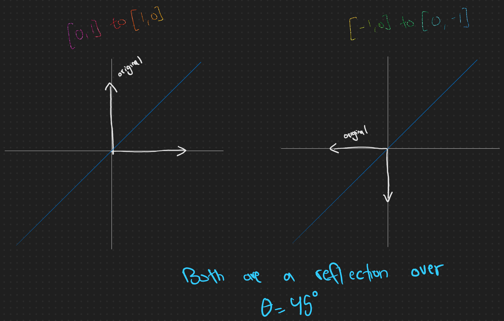

# Day 13: Mine Cart Madness - [Code](13.ts)
A crop of this size requires significant logistics to transport produce, soil, fertilizer, and so on. The Elves are very busy pushing things around in carts on some kind of rudimentary system of tracks they've come up with.

Seeing as how cart-and-track systems don't appear in recorded history for another 1000 years, the Elves seem to be making this up as they go along. They haven't even figured out how to avoid collisions yet.

You map out the tracks (your puzzle input) and see where you can help.

Tracks consist of straight paths (| and -), curves (/ and \), and intersections (+). Curves connect exactly two perpendicular pieces of track; for example, this is a closed loop:

```
/----\
|    |
|    |
\----/
```

Intersections occur when two perpendicular paths cross. At an intersection, a cart is capable of turning left, turning right, or continuing straight. Here are two loops connected by two intersections:

```
/-----\
|     |
|  /--+--\
|  |  |  |
\--+--/  |
   |     |
   \-----/
```

Several carts are also on the tracks. Carts always face either up (^), down (v), left (<), or right (>). (On your initial map, the track under each cart is a straight path matching the direction the cart is facing.)

Each time a cart has the option to turn (by arriving at any intersection), it turns **left the first time**, goes **straight** the second time, turns **right** the third time, and then repeats those directions starting again with left the fourth time, straight the fifth time, and so on. This process is independent of the particular intersection at which the cart has arrived - that is, the cart has no per-intersection memory.

Carts all move at the same speed; they take turns moving a single step at a time. They do this based on their current location: carts on the **top row move first** (acting from left to right), then carts on the second row move (again from left to right), then carts on the third row, and so on. Once each cart has moved one step, the process repeats; each of these loops is called a tick.

For example, suppose there are two carts on a straight track:

```
|  |  |  |  |
v  |  |  |  |
|  v  v  |  |
|  |  |  v  X
|  |  ^  ^  |
^  ^  |  |  |
|  |  |  |  |
```

First, the top cart moves. It is facing down (v), so it moves down one square. Second, the bottom cart moves. It is facing up (^), so it moves up one square. Because all carts have moved, the first tick ends. Then, the process repeats, starting with the first cart. The first cart moves down, then the second cart moves up - right into the first cart, colliding with it! (The location of the crash is marked with an X.) This ends the second and last tick.

Here is a longer example:

```
/->-\
|   |  /----\
| /-+--+-\  |
| | |  | v  |
\-+-/  \-+--/
  \------/

/-->\
|   |  /----\
| /-+--+-\  |
| | |  | |  |
\-+-/  \->--/
  \------/

/---v
|   |  /----\
| /-+--+-\  |
| | |  | |  |
\-+-/  \-+>-/
  \------/

/---\
|   v  /----\
| /-+--+-\  |
| | |  | |  |
\-+-/  \-+->/
  \------/

/---\
|   |  /----\
| /->--+-\  |
| | |  | |  |
\-+-/  \-+--^
  \------/

/---\
|   |  /----\
| /-+>-+-\  |
| | |  | |  ^
\-+-/  \-+--/
  \------/

/---\
|   |  /----\
| /-+->+-\  ^
| | |  | |  |
\-+-/  \-+--/
  \------/

/---\
|   |  /----<
| /-+-->-\  |
| | |  | |  |
\-+-/  \-+--/
  \------/

/---\
|   |  /---<\
| /-+--+>\  |
| | |  | |  |
\-+-/  \-+--/
  \------/

/---\
|   |  /--<-\
| /-+--+-v  |
| | |  | |  |
\-+-/  \-+--/
  \------/

/---\
|   |  /-<--\
| /-+--+-\  |
| | |  | v  |
\-+-/  \-+--/
  \------/

/---\
|   |  /<---\
| /-+--+-\  |
| | |  | |  |
\-+-/  \-<--/
  \------/

/---\
|   |  v----\
| /-+--+-\  |
| | |  | |  |
\-+-/  \<+--/
  \------/

/---\
|   |  /----\
| /-+--v-\  |
| | |  | |  |
\-+-/  ^-+--/
  \------/

/---\
|   |  /----\
| /-+--+-\  |
| | |  X |  |
\-+-/  \-+--/
  \------/
```

After following their respective paths for a while, the carts eventually crash. To help prevent crashes, you'd like to know **the location of the first crash**. Locations are given in X,Y coordinates, where the furthest left column is X=0 and the furthest top row is Y=0:

```
           111
 0123456789012
0/---\
1|   |  /----\
2| /-+--+-\  |
3| | |  X |  |
4\-+-/  \-+--/
5  \------/
```

In this example, the location of the first crash is `7,3`.

## Part Two
There isn't much you can do to prevent crashes in this ridiculous system. However, by predicting the crashes, the Elves know where to be in advance and **instantly remove the two crashing carts** the moment any crash occurs.

They can proceed like this for a while, but eventually, they're going to run out of carts. It could be useful to figure out where the last cart that hasn't crashed will end up.

For example:

```
/>-<\
|   |
| /<+-\
| | | v
\>+</ |
  |   ^
  \<->/

/---\
|   |
| v-+-\
| | | |
\-+-/ |
  |   |
  ^---^

/---\
|   |
| /-+-\
| v | |
\-+-/ |
  ^   ^
  \---/

/---\
|   |
| /-+-\
| | | |
\-+-/ ^
  |   |
  \---/
```

After four very expensive crashes, a tick ends with only one cart remaining; its final location is **6,4**.

**What is the location of the last cart** at the end of the first tick where it is the only cart left?

# Solution
The solution to this problem relies heavily on rotation and reflection matrices. I.e., you must be comfortable with

$$
\text{Rotation} =
\Big[\begin{matrix}
\cos{\theta} & -\sin{\theta}\\
\sin{\theta} & \cos{\theta}
\end{matrix}\Big]\;\;\;\;\;\;\;\;\;
\text{Reflection} =
\Big[\begin{matrix}
\cos{2\theta} & \sin{2\theta}\\
\sin{2\theta} & -\cos{2\theta}
\end{matrix}\Big]
$$

**Note to self**: In OneNote, check out
* Mathematics > Linear Algebra > Ch.2 Vector Spaces > Change of Basis
* Mathematics > Linear Algebra > Ch.3 Linear Operators > Rotation/Reflection
* Mathematics > Linear Algebra > Ch.3 Linear Operators > Remember Rotation&Reflection

Each cart is represented as an object that has a position, a direction (in vector notation), and its next turn:

```typescript
type Direction = [number, number]; // [x, y] vector

enum Turn {
    Left,
    Straight,
    Right,
}

export interface IPosition {
    x: number;
    y: number;
    dir: Direction;
    nextTurn: Turn;
}

const getCartIfExists = (grid: string[][], row: number, col: number): IPosition | null => {
    const val = grid[row][col];
    const position = {
        x: col,
        y: row,
        nextTurn: Turn.Left,
    } as const;
    switch (val) {
        case '^': return { ...position, dir: [0, -1]};
        case 'v': return { ...position, dir: [0, 1] };
        case '>': return { ...position, dir: [1, 0] };
        case '<': return { ...position, dir: [-1, 0] };
        default: return null;
    }
};
```

The reason `^` is represented as `[0, -1]` is because `(0, 0)` is top-left corner.

The next thing we need to do is represent the array of `carts`. We'll do this via a `PriorityQueue` such that carts in the top row (left to right) are popped first.

```typescript
export interface ISimulation {
    name: string;
    grid: string[][];
    carts: PriorityQueue<IPosition>;
}

export const buildQueue = (grid: string[][], data?: IPosition[]) => {
    const cols = Math.max(...grid.map(row => row.length));
    const queue = new PriorityQueue<IPosition>(p => -1 * (p.y * cols + p.x));
    if (data != null && data.length > 0) {
        // will heapify it in O(N)
        queue.values = data;
    }
    return queue;
};
```

Then, we move all the carts until there is a collision:

```typescript
const isSimulation = (sp: ISimulation | IPosition): sp is ISimulation => {
    return (sp as ISimulation).name != null;
};

export const playSimulation = (s: ISimulation) => {
    let nextSim: ISimulation | IPosition = s;
    let count = 0;
    do {
        // print(nextSim);
        count++;
        nextSim = moveAllCarts(nextSim as ISimulation);
    } while (isSimulation(nextSim));
    console.log('took', count, 'attempts');
    return nextSim;
};

export const moveAllCarts = (s: ISimulation): ISimulation | IPosition => {
    const getKey = (p: IPosition) => `${p.x},${p.y}`;
    // add the current positions to the map from queue, and as we iterate through
    // the queue, remove the current positions and add the new positions
    // this will allow us to find collisions of cart X moving into cart Y
    // that hasn't moved yet.
    const nextPositions = new Map<string, IPosition>(
        s.carts.values.map(c => [getKey(c), c])
    );
    const queue = s.carts;
    const moveCart = makeMoveCart(s.grid);
    while (!queue.isEmpty()) {
        const pos = queue.dequeue()!;
        const nextPos = moveCart(pos);
        const nextPosKey = getKey(nextPos);
        nextPositions.delete(getKey(pos));
        // if next position already exists, there is a collision.
        if (nextPositions.has(nextPosKey)) {
            return nextPos;
        } else {
            nextPositions.set(nextPosKey, nextPos);
        }
    }
    return {
        ...s,
        carts: buildQueue(s.grid, Array.from(nextPositions.values()))
    };
};
```

The key thing to disect then is `moveCart`. We'll first look at the junctions `+`.

When a cart turns left, it's really turning counter-clockwise, or mathematically, doing a `+90deg` rotation. When it's turning right, or clockwise, it's doing a `-90deg` rotation. In an `XY` coordinate system, the following vectors represent our directions:
* `^` is `[0, 1]`
* `v` is `[0, -1]`
* `>` is `[1, 0]`
* `<` is `[-1, 0]`

The difference of `^` and `v` from the math form and our code will be revisited.

When doing a $\theta = +90^o$ rotation, our rotation matrix is
$
R_{ccw} = \Big[\begin{matrix}
0 & -1\\
1 & 0
\end{matrix}\Big]
$
and when doing a $\theta = -90^o$ rotation, the rotation matrix is
$
R_{cw} = \Big[\begin{matrix}
0 & 1\\
-1 & 0
\end{matrix}\Big]
$

Meaning a `[x y]` vector being rotated by $\theta = +90^o$ becomes

$
\vec{v} = \Big[\begin{matrix} 0 & -1\\ 1 & 0 \end{matrix}\Big] \Big[\begin{matrix} x\\ y \end{matrix}\Big] = \Big[\begin{matrix} -y\\ x \end{matrix}\Big]
$

and `[x y]` rotated by $\theta = -90^o$ becomes

$
\vec{v} = \Big[\begin{matrix} 0 & 1\\ -1 & 0 \end{matrix}\Big] \Big[\begin{matrix} x\\ y \end{matrix}\Big] = \Big[\begin{matrix} y\\ -x \end{matrix}\Big]
$

What about the corners? `/` and `\`? Well, consider this:

```
/--         >--
^       ->  |
```

and

```
/<-         v--
|       ->  |
```

Here's a better visual of what's going on:



As you can see, both vectors are simply a reflection over the line $y=x$, or $\theta=45^o$. Plugging that into the reflection matrix at the very beginning gives us

$
\vec{v} = \Big[\begin{matrix} 0 & 1\\ 1 & 0 \end{matrix}\Big] \Big[\begin{matrix} x\\ y \end{matrix}\Big] = \Big[\begin{matrix} y\\ x \end{matrix}\Big]
$

And for the other turn, `\`, it's a $\theta=-45^o$ reflection, which gives us

$
\vec{v} = \Big[\begin{matrix} 0 & -1\\ -1 & 0 \end{matrix}\Big] \Big[\begin{matrix} x\\ y \end{matrix}\Big] = \Big[\begin{matrix} -y\\ -x \end{matrix}\Big]
$

In summary, when the vectors are represented mathimatically,
* `^` is `[0, 1]`
* `v` is `[0, -1]`
* `>` is `[1, 0]`
* `<` is `[-1, 0]`

We can do the following transformations to the vectors to turn them:
* left: `[x y] -> [-y x]`
* right: `[x y] -> [y -x]`
* `/`: `[x y] -> [y x]`
* `\`: `[x y] -> [-y -x]`

### To make things more confusing....

However, all of this gets turned over its head because the vectors in our grid are represented differently:
* `^` is `[0, -1]`
* `v` is `[0, 1]`
* `>` is `[1, 0]`
* `<` is `[-1, 0]`

But we still want `^` to become `<`, i.e., we want `[0, -1]` to become `[-1, 0]`, which, **if you just look at the vectors**, is a **-90deg** rotation, despite `^` to `<` looking like a +90deg rotation.

Thus, a "left" becomes clockwise rotation, a "right" becomes a counter-clockwise rotation, a `/` reflection becomes a reflection over `-45deg`, and `\` reflection becomes a reflection over `+45deg`.
* left: `[x y] -> [y -x]`
* right: `[x y] -> [-y x]`
* `/`: `[x y] -> [-y -x]`
* `\`: `[x y] -> [y x]`

Which gives us the following code:

```typescript
export const turnCart = (p: IPosition): IPosition => {
    const newPosition = { ...p, nextTurn: (p.nextTurn + 1) % numTurns };
    const [x, y] = newPosition.dir;
    switch (p.nextTurn) {
        case Turn.Straight: return newPosition;
        case Turn.Right: return { ...newPosition, dir: [-y, x] };
        case Turn.Left: return { ...newPosition, dir: [y, -x] };
    }
};

export const makeMoveCart = (grid: string[][]) => (p: IPosition): IPosition => {
    const [vx, vy] = p.dir;
    const y = p.y + vy;
    const x = p.x + vx;
    const next = grid[y][x];
    if (next == null) {
        throw `Position (${x}, ${y}) is null.`;
    } else if (next === '+') {
        return turnCart({ ...p, x, y });
    } else if (next === '/') {
        return { ...p, x, y, dir: [-vy, -vx] };
    } else if (next === '\\') {
        return { ...p, x, y, dir: [vy, vx] };
    }
    return { ...p, x, y };
};
```

## Part 2 Solution - [Code](13b.ts)
Not as exciting as part 1. Just needed the ability to remove items from a `PriorityQueue`. Here's the code:

```typescript
export const moveAllCarts = (s: ISimulation): ISimulation => {
    const getKey = (p: IPosition) => `${p.x},${p.y}`;
    const nextPositions = new Map<string, IPosition>(
        s.carts.values.map(c => [getKey(c), c])
    );
    const queue = s.carts;
    const moveCart = makeMoveCart(s.grid);
    while (!queue.isEmpty()) {
        const pos = queue.dequeue()!;
        const next = moveCart(pos);
        const key = getKey(next);
        nextPositions.delete(getKey(pos)); // delete old position
        // if the new position is already in the Map, means there is a collision
        // with either a moved cart or a cart that hasn't moved yet.
        if (nextPositions.has(key)) {
            nextPositions.delete(key);
            // if you collide with cart not moved yet, it'll be in the queue
            // still, so you need to remove it.
            queue.remove(next);
        } else {
            nextPositions.set(key, next);
        }
    }
    return {
        ...s,
        carts: buildQueue(s.grid, Array.from(nextPositions.values()))
    };
};

export const playSimulation = (s: ISimulation) => {
    let nextSim = s;
    let count = 0;
    do {
        // print(nextSim);
        count++;
        nextSim = moveAllCarts(nextSim as ISimulation);
    } while (nextSim.carts.size() > 1);
    console.log('took', count, 'attempts');
    return nextSim.carts.values;
};
```
