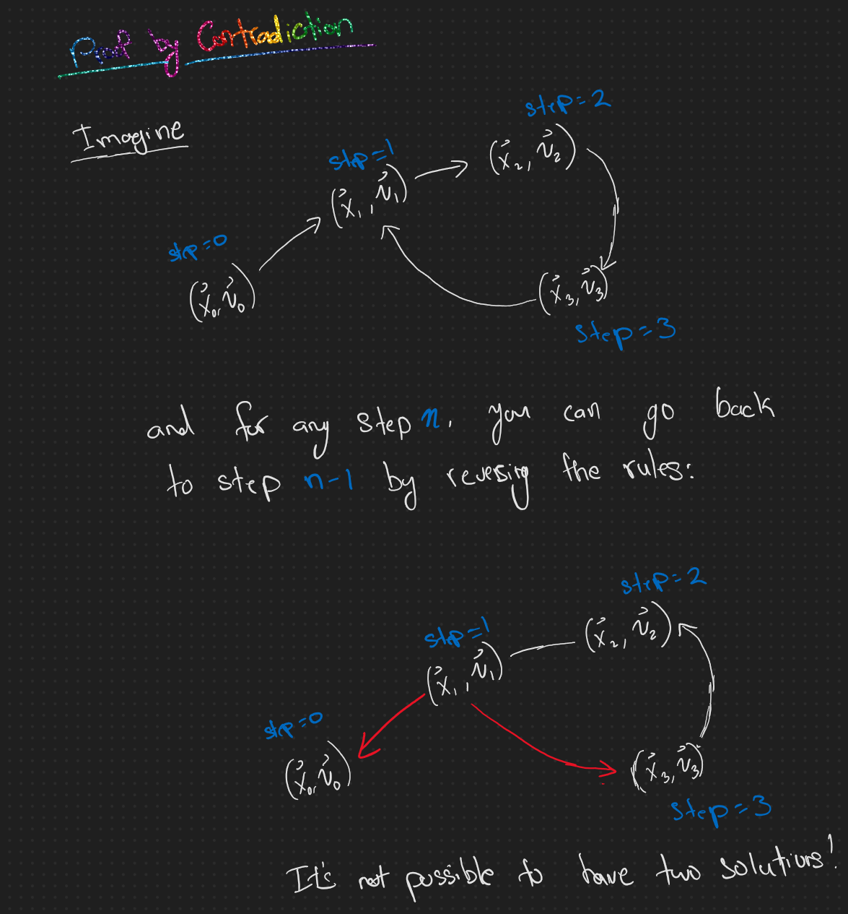

# Day 12: N-Body Problem - [Code](12.ts)
The space near Jupiter is not a very safe place; you need to be careful of a big distracting red spot, extreme radiation, and a whole lot of moons swirling around. You decide to start by tracking the four largest moons: Io, Europa, Ganymede, and Callisto.

After a brief scan, you calculate the position of each moon (your puzzle input). You just need to **simulate their motion** so you can avoid them.

Each moon has a 3-dimensional position (`x`, `y`, and `z`) and a 3-dimensional velocity. The position of each moon is given in your scan; the `x`, `y`, and `z` velocity of each moon starts at `0`.

Simulate the motion of the moons in t**ime steps**. Within each time step,
1. update the velocity of every moon by applying **gravity**. Then, once all moons' velocities have been updated,
2. update the position of every moon by applying **velocity**.
3. Time progresses by one step once all of the positions are updated.

To apply **gravity**, consider every pair of moons. On each axis (`x`, `y`, and `z`), the velocity of each moon changes by exactly +1 or -1 to pull the moons together. For example, if Ganymede has an x position of `3`, and Callisto has a x position of `5`, then Ganymede's `x` velocity changes by `+1` (because `5 > 3`) and Callisto's `x` velocity changes by `-1` (because `3 < 5`). However, if the positions on a given axis are the same, the velocity on that axis **does not change** for that pair of moons.

Once all gravity has been applied, apply **velocity**: simply add the velocity of each moon to its own position. For example, if Europa has a position of `x=1, y=2, z=3` and a velocity of `x=-2, y=0,z=3`, then its new position would be `x=-1, y=2, z=6`. This process does not modify the velocity of any moon.

For example, suppose your scan reveals the following positions:
```
<x=-1, y=0, z=2>
<x=2, y=-10, z=-7>
<x=4, y=-8, z=8>
<x=3, y=5, z=-1>
```
Simulating the motion of these moons would produce the following:
```
After 0 steps:
pos=<x=-1, y=  0, z= 2>, vel=<x= 0, y= 0, z= 0>
pos=<x= 2, y=-10, z=-7>, vel=<x= 0, y= 0, z= 0>
pos=<x= 4, y= -8, z= 8>, vel=<x= 0, y= 0, z= 0>
pos=<x= 3, y=  5, z=-1>, vel=<x= 0, y= 0, z= 0>

After 1 step:
pos=<x= 2, y=-1, z= 1>, vel=<x= 3, y=-1, z=-1>
pos=<x= 3, y=-7, z=-4>, vel=<x= 1, y= 3, z= 3>
pos=<x= 1, y=-7, z= 5>, vel=<x=-3, y= 1, z=-3>
pos=<x= 2, y= 2, z= 0>, vel=<x=-1, y=-3, z= 1>

After 2 steps:
pos=<x= 5, y=-3, z=-1>, vel=<x= 3, y=-2, z=-2>
pos=<x= 1, y=-2, z= 2>, vel=<x=-2, y= 5, z= 6>
pos=<x= 1, y=-4, z=-1>, vel=<x= 0, y= 3, z=-6>
pos=<x= 1, y=-4, z= 2>, vel=<x=-1, y=-6, z= 2>

After 3 steps:
pos=<x= 5, y=-6, z=-1>, vel=<x= 0, y=-3, z= 0>
pos=<x= 0, y= 0, z= 6>, vel=<x=-1, y= 2, z= 4>
pos=<x= 2, y= 1, z=-5>, vel=<x= 1, y= 5, z=-4>
pos=<x= 1, y=-8, z= 2>, vel=<x= 0, y=-4, z= 0>

After 4 steps:
pos=<x= 2, y=-8, z= 0>, vel=<x=-3, y=-2, z= 1>
pos=<x= 2, y= 1, z= 7>, vel=<x= 2, y= 1, z= 1>
pos=<x= 2, y= 3, z=-6>, vel=<x= 0, y= 2, z=-1>
pos=<x= 2, y=-9, z= 1>, vel=<x= 1, y=-1, z=-1>

After 5 steps:
pos=<x=-1, y=-9, z= 2>, vel=<x=-3, y=-1, z= 2>
pos=<x= 4, y= 1, z= 5>, vel=<x= 2, y= 0, z=-2>
pos=<x= 2, y= 2, z=-4>, vel=<x= 0, y=-1, z= 2>
pos=<x= 3, y=-7, z=-1>, vel=<x= 1, y= 2, z=-2>

After 6 steps:
pos=<x=-1, y=-7, z= 3>, vel=<x= 0, y= 2, z= 1>
pos=<x= 3, y= 0, z= 0>, vel=<x=-1, y=-1, z=-5>
pos=<x= 3, y=-2, z= 1>, vel=<x= 1, y=-4, z= 5>
pos=<x= 3, y=-4, z=-2>, vel=<x= 0, y= 3, z=-1>

After 7 steps:
pos=<x= 2, y=-2, z= 1>, vel=<x= 3, y= 5, z=-2>
pos=<x= 1, y=-4, z=-4>, vel=<x=-2, y=-4, z=-4>
pos=<x= 3, y=-7, z= 5>, vel=<x= 0, y=-5, z= 4>
pos=<x= 2, y= 0, z= 0>, vel=<x=-1, y= 4, z= 2>

After 8 steps:
pos=<x= 5, y= 2, z=-2>, vel=<x= 3, y= 4, z=-3>
pos=<x= 2, y=-7, z=-5>, vel=<x= 1, y=-3, z=-1>
pos=<x= 0, y=-9, z= 6>, vel=<x=-3, y=-2, z= 1>
pos=<x= 1, y= 1, z= 3>, vel=<x=-1, y= 1, z= 3>

After 9 steps:
pos=<x= 5, y= 3, z=-4>, vel=<x= 0, y= 1, z=-2>
pos=<x= 2, y=-9, z=-3>, vel=<x= 0, y=-2, z= 2>
pos=<x= 0, y=-8, z= 4>, vel=<x= 0, y= 1, z=-2>
pos=<x= 1, y= 1, z= 5>, vel=<x= 0, y= 0, z= 2>

After 10 steps:
pos=<x= 2, y= 1, z=-3>, vel=<x=-3, y=-2, z= 1>
pos=<x= 1, y=-8, z= 0>, vel=<x=-1, y= 1, z= 3>
pos=<x= 3, y=-6, z= 1>, vel=<x= 3, y= 2, z=-3>
pos=<x= 2, y= 0, z= 4>, vel=<x= 1, y=-1, z=-1>
```

Then, it might help to calculate the **total energy in the system**. The total energy for a single moon is its **potential energy** multiplied by its **kinetic energy**. A moon's potential energy is the sum of the absolute values of its x, y, and z position coordinates. A moon's kinetic energy is the sum of the absolute values of its velocity coordinates. Below, each line shows the calculations for a moon's potential energy (pot), kinetic energy (kin), and total energy:

```
Energy after 10 steps:
pot: 2 + 1 + 3 =  6;   kin: 3 + 2 + 1 = 6;   total:  6 * 6 = 36
pot: 1 + 8 + 0 =  9;   kin: 1 + 1 + 3 = 5;   total:  9 * 5 = 45
pot: 3 + 6 + 1 = 10;   kin: 3 + 2 + 3 = 8;   total: 10 * 8 = 80
pot: 2 + 0 + 4 =  6;   kin: 1 + 1 + 1 = 3;   total:  6 * 3 = 18
Sum of total energy: 36 + 45 + 80 + 18 = 179
```
In the above example, adding together the total energy for all moons after `10 steps` produces the total energy in the system, `179`.

**What is the total energy in the system** after simulating the moons given in your scan for **1000** steps?

Your puzzle answer was `6678`.

### Part 2 - [Code](12b.ts)
All this drifting around in space makes you wonder about the nature of the universe. Does history really repeat itself? You're curious whether the moons will ever return to a previous state.

Determine **the number of steps** that must occur before all of the moons' positions and velocities exactly match a previous point in time.

For example, the first example above takes `2772` steps before they exactly match a previous point in time; it eventually returns to the initial state:
```
After 0 steps:
pos=<x= -1, y=  0, z=  2>, vel=<x=  0, y=  0, z=  0>
pos=<x=  2, y=-10, z= -7>, vel=<x=  0, y=  0, z=  0>
pos=<x=  4, y= -8, z=  8>, vel=<x=  0, y=  0, z=  0>
pos=<x=  3, y=  5, z= -1>, vel=<x=  0, y=  0, z=  0>

After 2770 steps:
pos=<x=  2, y= -1, z=  1>, vel=<x= -3, y=  2, z=  2>
pos=<x=  3, y= -7, z= -4>, vel=<x=  2, y= -5, z= -6>
pos=<x=  1, y= -7, z=  5>, vel=<x=  0, y= -3, z=  6>
pos=<x=  2, y=  2, z=  0>, vel=<x=  1, y=  6, z= -2>

After 2771 steps:
pos=<x= -1, y=  0, z=  2>, vel=<x= -3, y=  1, z=  1>
pos=<x=  2, y=-10, z= -7>, vel=<x= -1, y= -3, z= -3>
pos=<x=  4, y= -8, z=  8>, vel=<x=  3, y= -1, z=  3>
pos=<x=  3, y=  5, z= -1>, vel=<x=  1, y=  3, z= -1>

After 2772 steps:
pos=<x= -1, y=  0, z=  2>, vel=<x=  0, y=  0, z=  0>
pos=<x=  2, y=-10, z= -7>, vel=<x=  0, y=  0, z=  0>
pos=<x=  4, y= -8, z=  8>, vel=<x=  0, y=  0, z=  0>
pos=<x=  3, y=  5, z= -1>, vel=<x=  0, y=  0, z=  0>
```

Of course, the universe might last for a very long time before repeating. Here's a copy of the second example from above:
```
<x=-8, y=-10, z=0>
<x=5, y=5, z=10>
<x=2, y=-7, z=3>
<x=9, y=-8, z=-3>
```
This set of initial positions takes `4686774924` steps before it repeats a previous state! Clearly, you might need to find a more efficient way to simulate the universe.

How many steps does it take to reach the first state that exactly matches a previous state?

Your puzzle answer was `496734501382552`.

## Solution
Two insights:
1. Each directional component moves independently. `x` component has no influence on the `y` component and `y` has no influence on `z`.
2. It's not possible for `step=N` @ `v.x=5, p.x=10` to repeat but not `step=0` @ `v.x=0, p.x=-1`. The entire cycle must repeat. Thus, all we have to do is figure out when the state @ `step=0` appears again. Why? Check out this proof by contradiction:



This, it must be the case that `step=0` @ `v.x=0, p.x=-1` repeats.

We can now solve this problem like so:
1. Figure out what steps  and  happens again. Call this .
2. Figure out what steps  and  happens again. Call this .
3. Figure out what steps  and  happens again. Call this .

Then figure out the total step by doing , right? **No, but super close!**

Imagine it's a 2D plane,  and . If we just multiply them together, we'd get . But there's a smaller  that satisfies both , and **that's **. Both  and  divide into . We get that by getting the **Least Common Multiple (LCM)** of S_z{s.name}`));
        console.log(getStepsForCircle(s.moons));
        console.log(timer.stop());
    }
};
```

## Appendix
### Calculating LCM

LCM of two numbers `a` and `b` can be defined as:

<p align="center"></p>

E.g.,

```
LCM(6, 10) = 6 * 10 / gcd(6, 10) = 60 / 2 = 30
```

For three numbers,

<p align="center"></p>

E.g., 
```
LCM(6, 10, 12)
    = LCM(6, 10) * 12 / gcd(LCM(6, 10), 12)
    = 30 * 12 / gcd(30, 12)
    = 30 * 12 / 6
    = 60
```

```typescript
export const getgcd = (a: number, b: number): number => {
    if (a === 0)
        return b;
    if (b === 0)
        return a;
    const numerator = Math.max(a, b);
    const denominator = Math.min(a, b);
    const remainder = numerator % denominator;

    return remainder === 0 ? denominator : getgcd(denominator, remainder);
};

export const lcm = (...n: number[]) => {
    return n.reduce((a, c) => a * c / getgcd(a, c), 1);
};

console.log(lcm(6, 6, 6)); // = 6
```