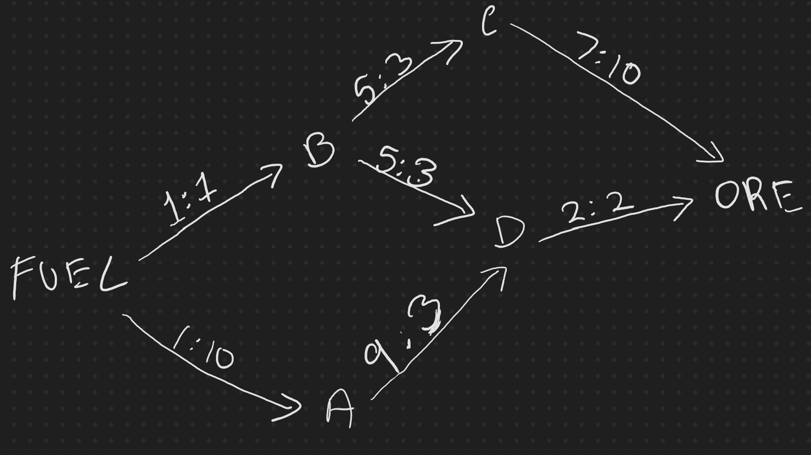
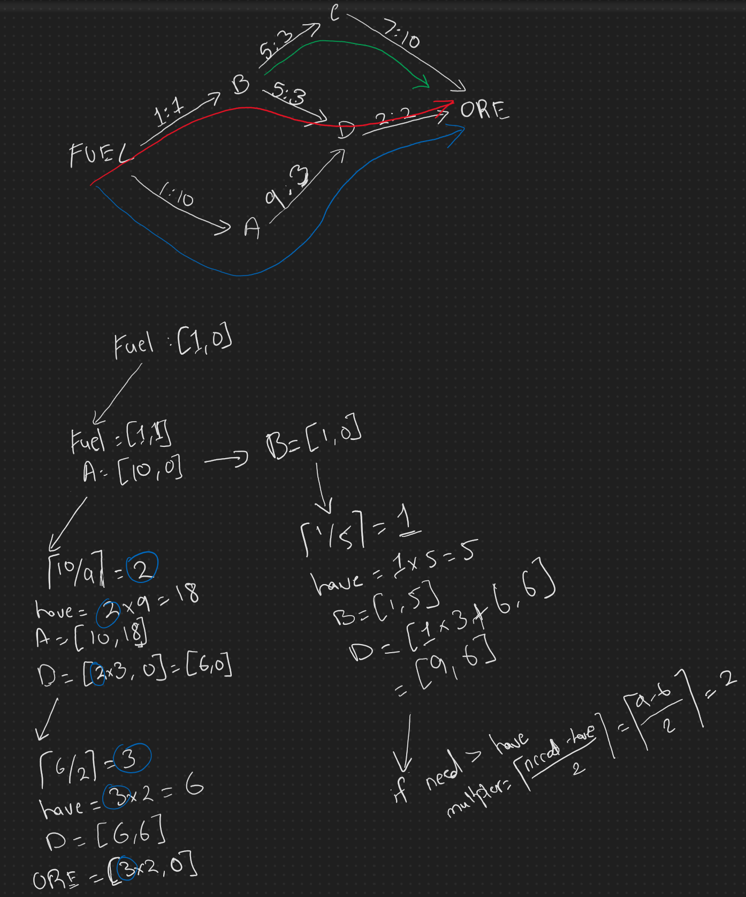

# Day 14: Stoichiometry
## Part 1
As you approach the rings of Saturn, your ship's *low fuel* indicator turns on. There isn't any fuel here, but the rings have plenty of raw material. Perhaps your ship's Inter-Stellar Refinery Union brand nanofactory can turn these raw materials into fuel.

You ask the nanofactory to produce a list of the **reactions** it can perform that are relevant to this process (your puzzle input). Every reaction turns some quantities of specific input chemicals into some quantity of an output chemical. Almost every chemical is produced by exactly one reaction; the only exception, `ORE`, is the raw material input to the entire process and is not produced by a reaction.

You just need to know how much `ORE` you'll need to collect before you can produce one unit of `FUEL`.

Each reaction gives specific quantities for its inputs and output; reactions cannot be partially run, so only whole integer multiples of these quantities can be used. (It's okay to have leftover chemicals when you're done, though.) For example, the reaction `1 A, 2 B, 3 C => 2 D` means that exactly 2 units of chemical `D` can be produced by consuming exactly 1 `A`, 2 `B` and 3 `C`. You can run the full reaction as many times as necessary; for example, you could produce 10 `D` by consuming 5 `A`, 10 `B`, and 15 `C`.

Suppose your nanofactory produces the following list of reactions:
```
10 ORE => 10 A
1 ORE => 1 B
7 A, 1 B => 1 C
7 A, 1 C => 1 D
7 A, 1 D => 1 E
7 A, 1 E => 1 FUEL
```

The first two reactions use only `ORE` as inputs; they indicate that you can produce as much of chemical `A` as you want (in increments of 10 units, each 10 costing 10 `ORE`) and as much of chemical `B` as you want (each costing 1 `ORE`). To produce 1 `FUEL`, a total of **31 `ORE`** is required: 1 `ORE` to produce 1 `B`, then 30 more `ORE` to produce the `7 + 7 + 7 + 7 = 28 A` *(with 2 extra `A` wasted)* required in the reactions to convert the `B` into `C`, `C` into `D`, `D` into `E`, and finally `E` into `FUEL`. (30 `A` is produced because its reaction requires that it is created in increments of 10.)

Or, suppose you have the following list of reactions:
```
9 ORE => 2 A
8 ORE => 3 B
7 ORE => 5 C
3 A, 4 B => 1 AB
5 B, 7 C => 1 BC
4 C, 1 A => 1 CA
2 AB, 3 BC, 4 CA => 1 FUEL
```
The above list of reactions requires 165 ORE to produce 1 `FUEL`:

* Consume 45 `ORE` to produce 10 `A`.
* Consume 64 `ORE` to produce 24 `B`.
* Consume 56 `ORE` to produce 40 `C`.
* Consume 6 `A`, 8 `B` to produce 2 `AB`.
* Consume 15 `B`, 21 `C` to produce 3 `BC`.
* Consume 16 `C`, 4 `A` to produce 4 `CA`.
* Consume 2 `AB`, 3 `BC`, 4 `CA` to produce 1 `FUEL`.

Here are some larger examples:

* 13,312 `ORE` for 1 `FUEL`:
    ```
    157 ORE => 5 NZVS
    165 ORE => 6 DCFZ
    44 XJWVT, 5 KHKGT, 1 QDVJ, 29 NZVS, 9 GPVTF, 48 HKGWZ => 1 FUEL
    12 HKGWZ, 1 GPVTF, 8 PSHF => 9 QDVJ
    179 ORE => 7 PSHF
    177 ORE => 5 HKGWZ
    7 DCFZ, 7 PSHF => 2 XJWVT
    165 ORE => 2 GPVTF
    3 DCFZ, 7 NZVS, 5 HKGWZ, 10 PSHF => 8 KHKGT
    ```
* 180,697 `ORE` for 1 `FUEL`:
    ```
    2 VPVL, 7 FWMGM, 2 CXFTF, 11 MNCFX => 1 STKFG
    17 NVRVD, 3 JNWZP => 8 VPVL
    53 STKFG, 6 MNCFX, 46 VJHF, 81 HVMC, 68 CXFTF, 25 GNMV => 1 FUEL
    22 VJHF, 37 MNCFX => 5 FWMGM
    139 ORE => 4 NVRVD
    144 ORE => 7 JNWZP
    5 MNCFX, 7 RFSQX, 2 FWMGM, 2 VPVL, 19 CXFTF => 3 HVMC
    5 VJHF, 7 MNCFX, 9 VPVL, 37 CXFTF => 6 GNMV
    145 ORE => 6 MNCFX
    1 NVRVD => 8 CXFTF
    1 VJHF, 6 MNCFX => 4 RFSQX
    176 ORE => 6 VJHF
    ```
* 2210736 ORE for 1 FUEL:
    ```
    171 ORE => 8 CNZTR
    7 ZLQW, 3 BMBT, 9 XCVML, 26 XMNCP, 1 WPTQ, 2 MZWV, 1 RJRHP => 4 PLWSL
    114 ORE => 4 BHXH
    14 VRPVC => 6 BMBT
    6 BHXH, 18 KTJDG, 12 WPTQ, 7 PLWSL, 31 FHTLT, 37 ZDVW => 1 FUEL
    6 WPTQ, 2 BMBT, 8 ZLQW, 18 KTJDG, 1 XMNCP, 6 MZWV, 1 RJRHP => 6 FHTLT
    15 XDBXC, 2 LTCX, 1 VRPVC => 6 ZLQW
    13 WPTQ, 10 LTCX, 3 RJRHP, 14 XMNCP, 2 MZWV, 1 ZLQW => 1 ZDVW
    5 BMBT => 4 WPTQ
    189 ORE => 9 KTJDG
    1 MZWV, 17 XDBXC, 3 XCVML => 2 XMNCP
    12 VRPVC, 27 CNZTR => 2 XDBXC
    15 KTJDG, 12 BHXH => 5 XCVML
    3 BHXH, 2 VRPVC => 7 MZWV
    121 ORE => 7 VRPVC
    7 XCVML => 6 RJRHP
    5 BHXH, 4 VRPVC => 5 LTCX
    ```
Given the list of reactions in your puzzle input, **what is the minimum amount of `ORE` required to produce exactly 1 `FUEL`?**

## Part 2
After collecting `ORE` for a while, you check your cargo hold: 1 trillion (`1000000000000`) units of `ORE`.

With that much ore, given the examples above:
* The `13312` `ORE`-per-`FUEL` example could produce `82892753` `FUEL`.
* The `180697` `ORE`-per-`FUEL` example could produce `5586022` `FUEL`.
* The `2210736` `ORE`-per-`FUEL` example could produce `460664` `FUEL`.

Given 1 trillion `ORE`, what is the maximum amount of `FUEL` you can produce?

## Solution (Part 1)
#### TLDR
1. Convert the reactions into a graph, with a directed edge *from products to reactions*. This will become an acyclic graph from `FUEL` to `ORES`. 
2. Maintain a Map/Dictionary for each element that stores its `needs` and `haves`, with each element initally having `[need, have] = [0, 0]`.
3. Set `FUEL`'s needs to `1`.
4. Do a DFS traversal from `FUEL` to all nodes.

#### Example
Assume we're given the following input:

```
10 ORE => 7 C
2 ORE => 2 D
3 C, 3 D => 5 B
3 D => 9 A
1 B, 10 A => 1 FUEL
```

This translates to the following graph:



which leads to the following traversal of the graph:



#### Code
```typescript
interface IRatio {
    product: number;
    reactant: number;
}

const getOresForFuel = (graph: WGraph<string, IRatio>, fuelNeeded = 1) => {
    const fuel = 'FUEL';
    const ore = 'ORE';
    const needsHaves =
        new Map(graph.vertices.map<[string, [number, number]]>(v => [v, [0, 0]]));

    const helper = (node: string) => {
        if (graph.getAdjList(node).length === 0)
            return;

        const [need, have] = needsHaves.get(node)!;
        if (have > need)
            return;

        const reactants = graph.getAdjList(node);
        // for equation 4D + 3C -> 5B, we'll have the following edges,
        // assuming node = B, reactants = C, D
        //      B to C, weight: { product: 5, reactant: 3 }
        //      B to D, weight: { product: 5, reactant: 4 }
        // so we just do first(reactants) because all weights will have a product = 5
        const { product: productMadePerReaction } = graph.getWeight(node, first(reactants))!;
        const multiplier = Math.ceil((need - have) / productMadePerReaction);

        const nowHas = have + productMadePerReaction * multiplier;
        needsHaves.set(node, [need, nowHas]);

        for (const reactant of reactants) {
            const { reactant: reactantNeededPerReaction } = graph.getWeight(node, reactant)!;
            const [rNeed, rHave] = needsHaves.get(reactant)!;
            // keep the 'have's for the reactant the same, but increase the need for the
            // reactants because we increased the 'have's for the product. E.g.,
            // if 4D + 3C -> 5B, and we made 10 Bs above the for loop, multiplier = 2
            // and now we need to increase the needs of D by 8 and C by 6.
            needsHaves.set(
                reactant,
                [rNeed + multiplier * reactantNeededPerReaction, rHave]
            );
            helper(reactant);
        }
    };
    needsHaves.set(fuel, [fuelNeeded, 0]);
    helper(fuel);
    return needsHaves.get(ore)?.[0] ?? 0;
};
```

## Solution (Part 2)
I simply kept doing the function in part 1 by passing a different `fuelNeeded` to get the number of `ores` under `target`. One really clever solution was to use **linear regression**! Someone else did it on reddit, but here's the gist of their solution:

```csharp
long desiredOre = 1000000000000;

var x1 = 10000; //arbitrarily large enough
var x2 = 100000; //arbitrarily large enough

long y1 = OrePerFuel(x1);
long y2 = OrePerFuel(x2);

var slope = (double) (y2 - y1) / (x2 - x1);
var b = y1 - slope * x1;
var fuel = Math.Ceiling((desiredOre - b) / slope);
Console.WriteLine($"fuel {fuel}");
```

My solution:
```typescript
export const maxFuelFrom = (graph: WGraph<string, IRatio>, oresAvailable: number) => {
    const oresPerFuel = getOresForFuel(graph, 1);
    if (oresAvailable < oresPerFuel)
        return 0;

    // first guess. If it takes 30 ores to make 1 fuel, and 90 ores are available, your upperbound would be
    // 90 / 30 = 3 fuels. However, it's very likely you'll make way more than 3 fuels because there are usually spare
    // materials when making just 1 fuel, which can be reused to make the second fuel, and so on.
    let fuelGuess = Math.floor(oresAvailable / oresPerFuel);
    let oresFromFuelGuess = getOresForFuel(graph, fuelGuess);

    while (oresAvailable > oresFromFuelGuess) {
        // line below this will tell us how many fuels we are off by
        const fuelGuessAddition = Math.ceil((oresAvailable - oresFromFuelGuess) / oresPerFuel) + 1;
        fuelGuess += fuelGuessAddition;
        oresFromFuelGuess = getOresForFuel(graph, fuelGuess);
    }

    // if our guess of ores went over the requiredNumOfOres
    while (oresFromFuelGuess > oresAvailable) {
        fuelGuess--;
        oresFromFuelGuess = getOresForFuel(graph, fuelGuess);
    }

    return {
        oresPerFuel: oresPerFuel.toLocaleString(),
        maxFuel: fuelGuess.toLocaleString(),
        oresUsed: oresFromFuelGuess.toLocaleString(),
        leftOver: (oresAvailable - oresFromFuelGuess).toLocaleString()
    };
};

export const run = () => {
    const ores = 1_000_000_000_000;
    const sims = getSimulations(); // .slice(0, 1);
    for (const s of sims) {
        console.log(timer.start(`14b - ${s.name}`));
        console.log(maxFuelFrom(s.reactions, ores));
        console.log(timer.stop());
    }
};
```