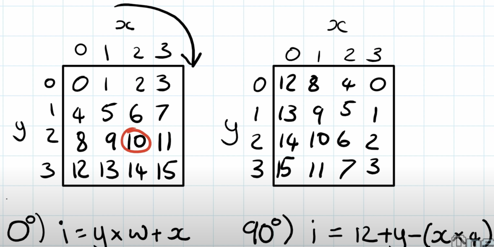

# Day 20 - Jurassic Jigsaw - [Part1](20.ts) [Part2](20b.ts)

The high-speed train leaves the forest and quickly carries you south. You can
even see a desert in the distance! Since you have some spare time, you might as
well see if there was anything interesting in the image the Mythical Information
Bureau satellite captured.

After decoding the satellite messages, you discover that the data actually
contains many small images created by the satellite's **camera array**. The camera
array consists of many cameras; rather than produce a single square image, they
produce many smaller square image **tiles** that need to be **reassembled back into a
single image**.

Each camera in the camera array returns a single monochrome **image tile** with a
random unique **ID number**. The tiles (your puzzle input) arrived in a random
order.

Worse yet, the camera array appears to be malfunctioning: each image tile has
been **rotated and flipped to a random orientation**. Your first task is to
reassemble the original image by orienting the tiles so they fit together.

To show how the tiles should be reassembled, each tile's image data includes a
border that should line up exactly with its adjacent tiles. All tiles have this
border, and the border lines up exactly when the tiles are both oriented
correctly. Tiles at the edge of the image also have this border, but the
outermost edges won't line up with any other tiles.

For example, suppose you have the following nine tiles:

```
Tile 2311:
..##.#..#.
##..#.....
#...##..#.
####.#...#
##.##.###.
##...#.###
.#.#.#..##
..#....#..
###...#.#.
..###..###

Tile 1951:
#.##...##.
#.####...#
.....#..##
#...######
.##.#....#
.###.#####
###.##.##.
.###....#.
..#.#..#.#
#...##.#..

Tile 1171:
####...##.
#..##.#..#
##.#..#.#.
.###.####.
..###.####
.##....##.
.#...####.
#.##.####.
####..#...
.....##...

Tile 1427:
###.##.#..
.#..#.##..
.#.##.#..#
#.#.#.##.#
....#...##
...##..##.
...#.#####
.#.####.#.
..#..###.#
..##.#..#.

Tile 1489:
##.#.#....
..##...#..
.##..##...
..#...#...
#####...#.
#..#.#.#.#
...#.#.#..
##.#...##.
..##.##.##
###.##.#..

Tile 2473:
#....####.
#..#.##...
#.##..#...
######.#.#
.#...#.#.#
.#########
.###.#..#.
########.#
##...##.#.
..###.#.#.

Tile 2971:
..#.#....#
#...###...
#.#.###...
##.##..#..
.#####..##
.#..####.#
#..#.#..#.
..####.###
..#.#.###.
...#.#.#.#

Tile 2729:
...#.#.#.#
####.#....
..#.#.....
....#..#.#
.##..##.#.
.#.####...
####.#.#..
##.####...
##..#.##..
#.##...##.

Tile 3079:
#.#.#####.
.#..######
..#.......
######....
####.#..#.
.#...#.##.
#.#####.##
..#.###...
..#.......
..#.###...
```

By rotating, flipping, and rearranging them, you can find a square arrangement that causes all adjacent borders to line up:

```
#...##.#.. ..###..### #.#.#####.
..#.#..#.# ###...#.#. .#..######
.###....#. ..#....#.. ..#.......
###.##.##. .#.#.#..## ######....
.###.##### ##...#.### ####.#..#.
.##.#....# ##.##.###. .#...#.##.
#...###### ####.#...# #.#####.##
.....#..## #...##..#. ..#.###...
#.####...# ##..#..... ..#.......
#.##...##. ..##.#..#. ..#.###...

#.##...##. ..##.#..#. ..#.###...
##..#.##.. ..#..###.# ##.##....#
##.####... .#.####.#. ..#.###..#
####.#.#.. ...#.##### ###.#..###
.#.####... ...##..##. .######.##
.##..##.#. ....#...## #.#.#.#...
....#..#.# #.#.#.##.# #.###.###.
..#.#..... .#.##.#..# #.###.##..
####.#.... .#..#.##.. .######...
...#.#.#.# ###.##.#.. .##...####

...#.#.#.# ###.##.#.. .##...####
..#.#.###. ..##.##.## #..#.##..#
..####.### ##.#...##. .#.#..#.##
#..#.#..#. ...#.#.#.. .####.###.
.#..####.# #..#.#.#.# ####.###..
.#####..## #####...#. .##....##.
##.##..#.. ..#...#... .####...#.
#.#.###... .##..##... .####.##.#
#...###... ..##...#.. ...#..####
..#.#....# ##.#.#.... ...##.....
```

For reference, the IDs of the above tiles are:

```
1951    2311    3079
2729    1427    2473
2971    1489    1171
```

To check that you've assembled the image correctly, multiply the IDs of the four
corner tiles together. If you do this with the assembled tiles from the example
above, you get **1951 _ 3079 _ 2971 \* 1171 = 20899048083289**.

Assemble the tiles into an image. **What do you get if you multiply together the IDs of the four corner tiles?**

## Part Two

Now, you're ready to **check the image for sea monsters**.

The borders of each tile are not part of the actual image; start by removing
them.

In the example above, the tiles become:

```
.#.#..#. ##...#.# #..#####
###....# .#....#. .#......
##.##.## #.#.#..# #####...
###.#### #...#.## ###.#..#
##.#.... #.##.### #...#.##
...##### ###.#... .#####.#
....#..# ...##..# .#.###..
.####... #..#.... .#......

#..#.##. .#..###. #.##....
#.####.. #.####.# .#.###..
###.#.#. ..#.#### ##.#..##
#.####.. ..##..## ######.#
##..##.# ...#...# .#.#.#..
...#..#. .#.#.##. .###.###
.#.#.... #.##.#.. .###.##.
###.#... #..#.##. ######..

.#.#.### .##.##.# ..#.##..
.####.## #.#...## #.#..#.#
..#.#..# ..#.#.#. ####.###
#..####. ..#.#.#. ###.###.
#####..# ####...# ##....##
#.##..#. .#...#.. ####...#
.#.###.. ##..##.. ####.##.
...###.. .##...#. ..#..###
```

Remove the gaps to form the actual image:

```
.#.#..#.##...#.##..#####
###....#.#....#..#......
##.##.###.#.#..######...
###.#####...#.#####.#..#
##.#....#.##.####...#.##
...########.#....#####.#
....#..#...##..#.#.###..
.####...#..#.....#......
#..#.##..#..###.#.##....
#.####..#.####.#.#.###..
###.#.#...#.######.#..##
#.####....##..########.#
##..##.#...#...#.#.#.#..
...#..#..#.#.##..###.###
.#.#....#.##.#...###.##.
###.#...#..#.##.######..
.#.#.###.##.##.#..#.##..
.####.###.#...###.#..#.#
..#.#..#..#.#.#.####.###
#..####...#.#.#.###.###.
#####..#####...###....##
#.##..#..#...#..####...#
.#.###..##..##..####.##.
...###...##...#...#..###
```

Now, you're ready to search for sea monsters! Because your image is monochrome, a sea monster will look like this:

```
                  #
#    ##    ##    ###
 #  #  #  #  #  #
```

When looking for this pattern in the image, **the spaces can be anything**; only the
`#` need to match. Also, you might need to rotate or flip your image before it's
oriented correctly to find sea monsters. In the above image, **after flipping and
rotating it** to the appropriate orientation, there are **two** sea monsters (marked
with `O`):

```
.####...#####..#...###..
#####..#..#.#.####..#.#.
.#.#...#.###...#.##.O#..
#.O.##.OO#.#.OO.##.OOO##
..#O.#O#.O##O..O.#O##.##
...#.#..##.##...#..#..##
#.##.#..#.#..#..##.#.#..
.###.##.....#...###.#...
#.####.#.#....##.#..#.#.
##...#..#....#..#...####
..#.##...###..#.#####..#
....#.##.#.#####....#...
..##.##.###.....#.##..#.
#...#...###..####....##.
.#.##...#.##.#.#.###...#
#.###.#..####...##..#...
#.###...#.##...#.##O###.
.O##.#OO.###OO##..OOO##.
..O#.O..O..O.#O##O##.###
#.#..##.########..#..##.
#.#####..#.#...##..#....
#....##..#.#########..##
#...#.....#..##...###.##
#..###....##.#...##.##.#
```

Determine how rough the waters are in the sea monsters' habitat by counting the
number of # that are **not** part of a sea monster. In the above example, the
habitat's water roughness is **273**.

**How many # are not part of a sea monster?**

## Solution

For Part One, find corners by finding tiles that have two unique sides.

For Part Two, we introduce a [`Tile`](20-tile.ts) class that takes a `2D` square of strings:

```typescript
interface Tile {
  borders: Set<string>;
  bordersLocation: BiMap<string, Side>;

  /**
   * @param grid must be a square.
   */
  constructor(id: number, grid: string[][]);

  toString(withHeader: string);
  to2DArray(): string[][];
  get(x: number, y: number): string;
  getOrDefault(x: number, y: number): string|undefined;

  /**
   * Will align this tile to the other tile if possible. What that means is that
   * if the other tile's right side is identical to this tile's top side, then
   * this function will rotate this tile so that this tile's top side becomes
   * its LEFT side, so that other tile and this tile can be right next to each
   * other.
   * It also may be the case that the tiles match, but this tile may be flipped,
   * so the sides match but just in the opposite direction. In this case, we'll
   * need to flip over the x or y axis.
   */
  alignToTile(other: Tile): AlignTileResponse;
  rotate90DegreesCW();
  reflectOverXAxis();
  reflectOverYAxis();
```

What makes this problem noteworthy is how this class acheives **constant
runtime** for `alignToTile()`, `rotate90DegreesCW()`, `reflectOverXAxis()`,
`reflectOverYAxis()`, and `get(x, y)`.

We do this by first storing the `2D grid` as a `1D grid`, and then implementing
`get(x, y)` as something like this:

```typescript
get(x: number, y: number) {
  return x + y * w;
}
```

where `w` is the length of side of the `2d grid` square (meaning there are `w^2`
elements in this grid).

When we do a rotation or a reflection, we simply change how `(x, y)` gets
**transformed into an index** in our `1D grid`.

Consider this image of a 2D grid, where each element is just the `ith` index.
Doing a 90 degrees clockwise rotation on it gives you this 2D grid of the
indices:



We get a new equation to get the index in our `1D grid` from a given `(x, y)`:

```typescript
get(x: number, y: number) {
  return -w * x + y + C;
}
```

where `C` is the element at `get(0, w - 1)` before the rotation, and `w = 4` in
this case.

And doing another 90 degrees clockwise rotation makes the equation:

```typescript
get(x: number, y: number) {
  return -x - w * y + C;
}
```

where `C` is again the element at `get(0, w - 1)` before the rotation.

Finally, doing one more rotation gives us our last unique equation:

```typescript
get(x: number, y: number) {
  return w * x - y + C;
}
```

From our understanding of reflection and rotation from problem [2018 day
13](../2018/13.md), we know that vectors can be easily rotated with the rotation
matrix, but just from the examples above, apparently it also applies to images.
If you consider the transformation from `(x, y)` to `idx` as a vector like `[1, w]`, where `1` is the constant in front of `x`, `w` is the constant in front
of `y`, we get the original `get(x, y)` implementation. **Rotating the vector
that transforms (x,y) to idx transforms the image!**

Rotating `[1, w]` 90 degrees clockwise based on the rotation matrix gives us
`[-w, 1]` (it's just `rotate([x, y]) = [-y, x]`), and rotating that gives us
`[-1, -w]`, and finally rotating that gives us `[w, -1]`.

We'll actually make this vector 3-element long. The first two are the constants
on `x` and `y`, and the third element is a constant we add.

This gives us the following:

```typescript
/**
 * Rotate the vector that transforms (x, y) to an index in grid by 90 degrees
 * clockwise.
 */
rotate90DegreesCW() {
  const [xc, yc] = this.cordsToIdxVector;
  const newConstant = this.toIndex(0, this.size - 1);
  this.cordsToIdxVector = [-yc, xc, newConstant];
  this.dirty = true;
}

reflectOverYAxis() {
  const [xc, yc] = this.cordsToIdxVector;
  const newConstant = this.toIndex(this.size - 1, 0);
  this.cordsToIdxVector = [-xc, yc, newConstant];
  this.dirty = true;
}

reflectOverXAxis() {
  const [xc, yc] = this.cordsToIdxVector;
  const newConstant = this.toIndex(0, this.size - 1);
  this.cordsToIdxVector = [xc, -yc, newConstant];
  this.dirty = true;
}

get(x: number, y: number): string {
  return this.grid1D[this.toIndex(x, y)];
}

private toIndex(x: number, y: number) {
  assert(x, x >= 0 && x < this.size);
  assert(y, y >= 0 && y < this.size);
  const [xc, yc, c] = this.cordsToIdxVector;
  return x * xc + y * yc + c;
}
```

The `Tile` class holds a reference to the borders of the Tile. Instead of
computing that after every rotation/reflection, we do it lazily by using the
`this.dirty` flag.

The `Tile` class can be found [here](20-tile.ts).

The solution to Part Two is broken down into sub-problems:

```typescript
export function run() {
  declareProblem('day 20b');
  const sim = getSimulations()[1];
  timer.run(
    pipe(
      addBorderToTilesMapToSim, // Adds border -> Tile[] map to Simulation
      addCornerTilesToSim, // Finds corner and adds to Simulation
      assembleTiles, // Align each tile next to each other to build Tile[][]
      removeBordersFromAllTiles,
      combineToImage, // Converts the Tile[][] to a string[][]
      toTile, // Convert the entire image into a single Tile for easy rotation
      getSeaMonsterCount, // Find sea monster, searching all 8 orientations
      getWaterRoughness
    ),
    `day 20b - ${sim.name}`,
    sim
  );
}
```

The meat of the problem is `assembleTiles()`, which

1. Starts off at an arbitrary corner,
2. orient that corner so that its unique sides are at the top and left side,
   - It doesn't have to be the actual top-left corner. The image will still be
     formed correctly, it'll just be flipped or rotated. We can tackle that in
     `getSeaMonsterCount()`.
3. Add this corner to a Queue, where you do a breadth-first-search approach to
   generating the image: pop from queue, add it to where it's supposed to go,
   get its neighbors, align its neighbors, and put them in the Queue.
4. Do this as long as the Queue is not empty.

```typescript
function assembleTiles({
  tiles,
  borderToTiles,
  corners,
}: Sim & Borders & Corners): Tile[][] {
  // The image must be a square.
  const size = assert(Math.sqrt(tiles.length), (n) => Number.isInteger(n));
  const image: Tile[][] = Array.from({ length: size }, () => []);
  // location is [x, y]
  const queue = new Queue<{ tile: Tile; location: [number, number] }>();
  const visited = new Set<number>(); // tileId.
  const topLeft = corners[0];

  visited.add(topLeft.id);
  rotateUntilTopLeftCorner(borderToTiles, topLeft);
  queue.enqueue({ tile: topLeft, location: [0, 0] });

  while (!queue.isEmpty()) {
    const {
      tile,
      location: [x, y],
    } = queue.dequeue()!;
    image[y][x] = tile;
    for (const [border, side] of tile.bordersLocation) {
      const neighbor = borderToTiles
        .get(border)!
        .filter((b) => b.id !== tile.id)[0];

      if (neighbor && !visited.has(neighbor.id)) {
        neighbor.alignToTile(tile);
        visited.add(neighbor.id);
        const [dx, dy] = sideToVector.get(side)!;
        queue.enqueue({ tile: neighbor, location: [x + dx, y + dy] });
      }
    }
  }
  return image;
}
```

Finding a sub-image (sea monster) inside an image was done by converting the sea
monster into an array of `(x,y)` coordinates relative to the sea monster. Here
are all the coordinates of the `#` in the sea monster:

```typescript
[
  { dx: 0, dy: 0 },
  { dx: -18, dy: 1 },
  { dx: -13, dy: 1 },
  { dx: -12, dy: 1 },
  { dx: -7, dy: 1 },
  { dx: -6, dy: 1 },
  { dx: -1, dy: 1 },
  { dx: 0, dy: 1 },
  { dx: 1, dy: 1 },
  { dx: -17, dy: 2 },
  { dx: -14, dy: 2 },
  { dx: -11, dy: 2 },
  { dx: -8, dy: 2 },
  { dx: -5, dy: 2 },
  { dx: -2, dy: 2 },
];
```

`(dx, dy) = (0, 0)` is:

```
                  # <-- (0,0) is here
#    ##    ##    ###
 #  #  #  #  #  #
```

```typescript
const monsterImage = `
                  #
#    ##    ##    ###
 #  #  #  #  #  #`;

interface SeaMonsterResponse {
  tile: Tile;
  seaMonsterCount: number;
}

/**
 * @param tile The entire image as a single tile.
 */
function getSeaMonsterCount(tile: Tile): SeaMonsterResponse {
  // the first '#' should have a coordinate of (0,0), but it has a coordinate of
  // (18, 0), so we need to subract the 18.
  // Also, ignoring the first empty line.
  const monsterCords = monsterImage
    .split('\n')
    .slice(1) // the first line is an empty new line, so exclude that.
    .map((row, y) => row.split('').map((col, x) => ({ x, y, col })))
    .flat()
    .filter((data) => data.col === '#')
    .map((data) => ({ dx: data.x - 18, dy: data.y }));

  const isMonsterAt = (x: number, y: number) =>
    monsterCords.every((c) => tile.getOrDefault(x + c.dx, y + c.dy) === '#');

  const helper = (): number => {
    let count = 0;
    for (let i = 0; i < tile.size - 2; i++) {
      for (let j = 18; j < tile.size; j++) {
        if (isMonsterAt(j, i)) {
          count++;
        }
      }
    }
    return count;
  };

  // 4 for the 4 rotations.
  for (let i = 0; i < 4; i++) {
    const seaMonsterCount = helper();
    if (seaMonsterCount > 0) {
      return { tile, seaMonsterCount };
    }
    tile.rotate90DegreesCW();
  }

  // try the 4 rotations again after a reflection (in either X or Y direction).
  tile.reflectOverXAxis();

  // 4 for the 4 rotations, but after the reflection.
  for (let i = 0; i < 4; i++) {
    const seaMonsterCount = helper();
    if (seaMonsterCount > 0) {
      return { tile, seaMonsterCount };
    }
    tile.rotate90DegreesCW();
  }

  throw new Error('No sea monster was found in any orientation.');
}
```
